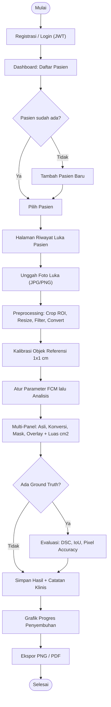
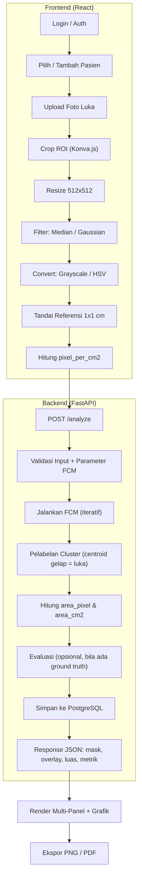
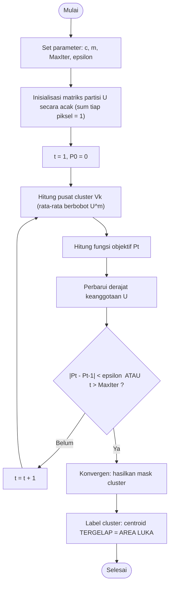
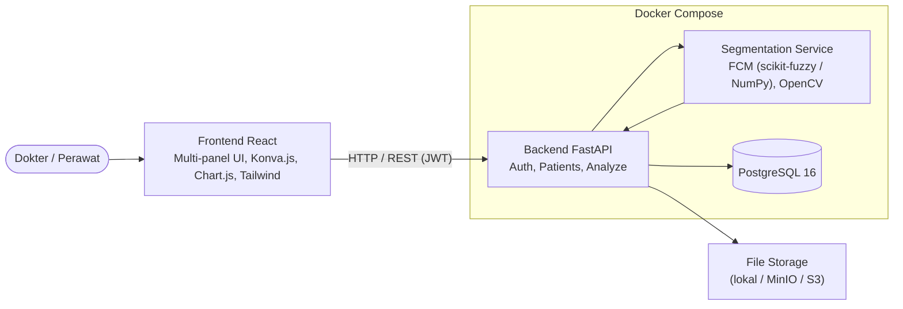
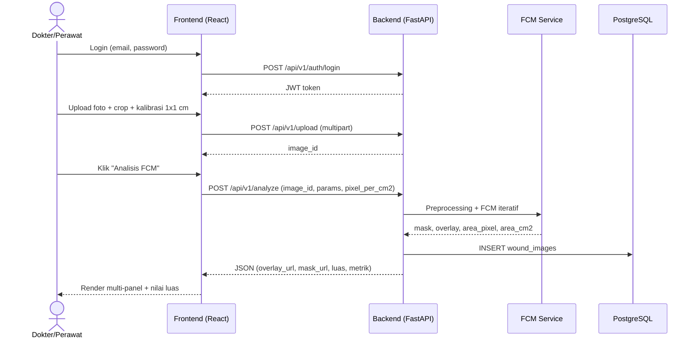
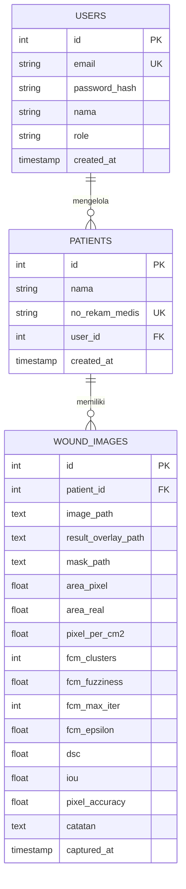
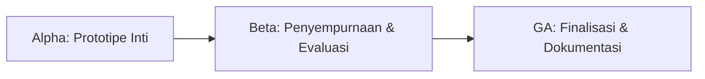
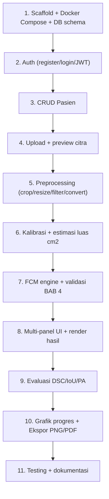

# PRD — Sistem Segmentasi & Estimasi Luas Luka Ulkus Diabetikum

**Berbasis Web App dengan Tampilan Multi-Panel (mirip MATLAB GUI)**

> Disusun berdasarkan skripsi BAB 1–BAB 4:
> *"Segmentasi dan Estimasi Luas Luka Ulkus Diabetikum Menggunakan Fuzzy C-Means pada RSUD Kolonel Abundjani Bangko"*

| Item | Keterangan |
|---|---|
| Versi Dokumen | 1.0 (Final untuk hand-off coding) |
| Status | Siap dikembangkan |
| Metode Inti | Fuzzy C-Means (FCM) |
| Target Akurasi | DSC, IoU, Pixel Accuracy ≥ 80% |
| Aktor | Tenaga Medis (dokter/perawat) |

---

## Daftar Isi

1. [Latar Belakang & Tujuan](#1-latar-belakang--tujuan)
2. [Ruang Lingkup](#2-ruang-lingkup)
3. [Aktor & Persona](#3-aktor--persona)
4. [User Flow (Diagram)](#4-user-flow-diagram)
5. [Pipeline Teknis End-to-End (Flowchart)](#5-pipeline-teknis-end-to-end-flowchart)
6. [Algoritma Fuzzy C-Means (Flowchart)](#6-algoritma-fuzzy-c-means-flowchart)
7. [Arsitektur Sistem (Diagram)](#7-arsitektur-sistem-diagram)
8. [Sequence Diagram](#8-sequence-diagram)
9. [Spesifikasi Fungsional](#9-spesifikasi-fungsional)
10. [Kontrak API (REST)](#10-kontrak-api-rest)
11. [Skema Database (ERD + SQL)](#11-skema-database-erd--sql)
12. [Tech Stack](#12-tech-stack)
13. [Spesifikasi Data Input](#13-spesifikasi-data-input)
14. [Rencana Pengujian](#14-rencana-pengujian)
15. [Kebutuhan Non-Fungsional](#15-kebutuhan-non-fungsional)
16. [Milestone & Roadmap](#16-milestone--roadmap)
17. [Struktur Proyek](#17-struktur-proyek)
18. [Acceptance Criteria (Definition of Done)](#18-acceptance-criteria-definition-of-done)

---

## 1. Latar Belakang & Tujuan

### 1.1 Masalah Saat Ini
Pengukuran luas luka ulkus diabetikum di RSUD Kolonel Abundjani Bangko masih dilakukan **manual** (penggaris / taksiran visual), dengan kelemahan:

- **Subjektif & tidak presisi** — bergantung persepsi pengukur.
- **Lambat & tidak efisien** — memakan waktu.
- **Risiko infeksi silang** — kontak fisik langsung dengan luka.
- **Tidak konsisten** — progres penyembuhan antar sesi sulit dibandingkan.

### 1.2 Solusi yang Diusulkan
Aplikasi **web** berbasis Digital Image Processing (DIP) yang:

1. Menyediakan **antarmuka multi-panel** mirip MATLAB GUI (beberapa panel citra dalam satu layar).
2. Melakukan **segmentasi otomatis** area luka vs kulit sehat dengan **Fuzzy C-Means (FCM)**.
3. Menghitung **estimasi luas luka dalam cm²** via kalibrasi piksel objek referensi 1×1 cm.
4. Menampilkan **visualisasi** segmentasi, overlay, dan grafik progres penyembuhan.
5. Menghitung **metrik evaluasi**: DSC, IoU, Pixel Accuracy.

### 1.3 Tujuan Produk
- Menggantikan pengukuran manual dengan pengukuran objektif, cepat, dan tanpa kontak fisik.
- Mendokumentasikan progres penyembuhan luka secara terstruktur dan dapat diaudit.
- Mencapai akurasi segmentasi **≥ 80%** pada ketiga metrik evaluasi.

### 1.4 Target Performa

| Metrik | Target Minimal |
|---|---|
| Dice Similarity Coefficient (DSC) | ≥ 80% |
| Intersection over Union (IoU) | ≥ 80% |
| Pixel Accuracy | ≥ 80% |
| Selisih estimasi luas vs manual | Seminimal mungkin |
| Waktu proses 1 citra | < beberapa detik (Ryzen 5 5600H / 16 GB) |

---

## 2. Ruang Lingkup

### Di Dalam Ruang Lingkup
- Autentikasi & manajemen akun (dokter/perawat) berbasis peran.
- Upload foto luka (JPG/PNG) dari browser.
- Preprocessing: crop ROI, resize 512×512, filtering, konversi ruang warna.
- Segmentasi FCM dengan parameter yang dapat dikonfigurasi.
- Kalibrasi piksel dengan objek referensi 1×1 cm.
- Estimasi luas luka dalam cm².
- Visualisasi multi-panel (asli, konversi, mask, overlay).
- Riwayat pasien + grafik progres penyembuhan.
- Evaluasi DSC/IoU/Pixel Accuracy (bila ada ground truth).
- Ekspor hasil (PNG/PDF).
- Penyimpanan data berbasis PostgreSQL + Docker.

### Di Luar Ruang Lingkup
- Diagnosis klinis otomatis (sistem hanya alat bantu pengukuran).
- Aplikasi mobile native.
- Integrasi rekam medis eksternal (tahap pertama).

---

## 3. Aktor & Persona

- **Aktor tunggal:** Tenaga Medis (dokter/perawat) RSUD Kolonel Abundjani Bangko.
- Kemampuan: registrasi, login, kelola pasien, unggah citra, jalankan analisis, baca & ekspor hasil.
- Catatan UX: pengguna **tidak teknis** → antarmuka wajib intuitif, minim istilah teknis.

---

## 4. User Flow (Diagram)



---

## 5. Pipeline Teknis End-to-End (Flowchart)



---

## 6. Algoritma Fuzzy C-Means (Flowchart)

FCM dipilih karena mampu menangani batas objek yang **tidak tegas** (gradasi warna pada tepi luka).

**Parameter:**

| Parameter | Keterangan | Nilai Default |
|---|---|---|
| `c` | Jumlah cluster | 2 (atau 3) |
| `m` | Fuzziness (derajat kekaburan) | 2.0 |
| `MaxIter` | Maksimum iterasi | 100 |
| `epsilon` | Ambang konvergensi | 1e-5 |



**Validasi acuan (BAB 4):** untuk data sampel 6 piksel `[210,190,200,85,70,60]`, hasil harus mendekati:
- `V1 = 192.57` (kulit sehat — lebih terang)
- `V2 = 78.15` (area luka — lebih gelap)

**Estimasi luas:**
```
pixel_per_cm2 = luas_area_referensi_dalam_piksel   (contoh BAB 4: 38x38 = 1.444 px/cm2)
pixel_luka    = jumlah piksel dengan mask == 1
luas_cm2      = pixel_luka / pixel_per_cm2
```

---

## 7. Arsitektur Sistem (Diagram)



---

## 8. Sequence Diagram



---

## 9. Spesifikasi Fungsional

### 9.1 Autentikasi & Akun
- [ ] Registrasi: email, password (bcrypt), peran (dokter/perawat).
- [ ] Login via JWT Bearer Token (OAuth2).
- [ ] Pengaturan profil pengguna.

### 9.2 Manajemen Pasien
- [ ] CRUD pasien (nama, no. rekam medis).
- [ ] 1 user → banyak pasien; 1 pasien → banyak foto luka.

### 9.3 Upload & Preprocessing
- [ ] Upload JPG/PNG (drag-and-drop / file dialog) + preview.
- [ ] **Crop ROI** interaktif (Konva.js).
- [ ] **Resize** ke 512×512.
- [ ] **Filter:** Median (noise impulsif) / Gaussian (smoothing).
- [ ] **Konversi warna:** Grayscale `[intensity]` atau HSV `[H,S,V]`.

### 9.4 Kalibrasi & Estimasi Luas
- [ ] Tandai objek referensi 1×1 cm di canvas (klik/drag).
- [ ] Hitung `pixel_per_cm2` otomatis.
- [ ] Hitung & tampilkan `luas_cm2`.

### 9.5 Segmentasi FCM
- [ ] Backend menerima citra terpreprocessing.
- [ ] Jalankan FCM (parameter dari user).
- [ ] Kembalikan mask biner, overlay, dan luas cm².

### 9.6 Visualisasi Multi-Panel

| Panel | Konten |
|---|---|
| A | Citra asli (RGB) |
| B | Citra hasil konversi (Grayscale/HSV) |
| C | Mask segmentasi FCM (biner) |
| D | Overlay mask pada citra asli |
| Output | Luas luka (cm² & piksel) |
| Opsional | DSC, IoU, Pixel Accuracy |

- [ ] Layout multi-panel (CSS Grid/Flexbox).
- [ ] Canvas interaktif (Konva.js) untuk crop & kalibrasi.
- [ ] Tombol aksi: Upload, Preprocessing, Kalibrasi, Analisis, Evaluasi, Simpan, Ekspor.

### 9.7 Pemantauan Progres
- [ ] Linimasa foto per pasien (kronologis).
- [ ] Grafik luas luka antar waktu (Chart.js).
- [ ] Perbandingan dua gambar berdampingan.

### 9.8 Evaluasi (Opsional)
```
TP = piksel luka terdeteksi benar
FP = bukan luka, salah terdeteksi luka
FN = piksel luka tidak terdeteksi
TN = bukan luka, benar tidak terdeteksi

DSC            = 2*TP / (2*TP + FP + FN)
IoU            = TP / (TP + FP + FN)
Pixel Accuracy = (TP + TN) / (TP + TN + FP + FN)
```
- [ ] Upload ground truth (mask manual).
- [ ] Backend hitung DSC/IoU/Pixel Accuracy.
- [ ] Tampilkan & simpan ke DB.

### 9.9 Ekspor & Laporan
- [ ] Unduh mask/overlay (PNG).
- [ ] Unduh ringkasan + luas sebagai PDF.
- [ ] Akses hasil hanya untuk pemilik akun.

---

## 10. Kontrak API (REST)

Base path: `/api/v1`

| Method | Endpoint | Body / Params | Response |
|---|---|---|---|
| POST | `/auth/register` | email, password, nama, role | user object |
| POST | `/auth/login` | email, password | `{ access_token, token_type }` |
| GET | `/patients` | — | daftar pasien milik user |
| POST | `/patients` | nama, no_rekam_medis | patient object |
| GET | `/patients/{id}` | — | detail + riwayat foto |
| PUT | `/patients/{id}` | nama, no_rekam_medis | patient object |
| DELETE | `/patients/{id}` | — | status |
| POST | `/upload` | multipart: file, patient_id | `{ image_id, image_url }` |
| POST | `/analyze` | image_id, fcm params, pixel_per_cm2 | `{ mask_url, overlay_url, area_pixel, area_cm2, metrik? }` |
| POST | `/evaluate` | image_id, ground_truth (file) | `{ dsc, iou, pixel_accuracy }` |
| GET | `/patients/{id}/progress` | — | deret waktu luas luka |
| GET | `/wound-images/{id}/export` | format=png\|pdf | file |

> Semua endpoint (kecuali auth) wajib header `Authorization: Bearer <JWT>`.

**Contoh request `/analyze`:**
```json
{
  "image_id": 123,
  "fcm": { "clusters": 2, "fuzziness": 2.0, "max_iter": 100, "epsilon": 1e-5 },
  "color_space": "hsv",
  "filter": "median",
  "pixel_per_cm2": 1444.0
}
```

**Contoh response `/analyze`:**
```json
{
  "image_id": 123,
  "mask_url": "/files/mask_123.png",
  "overlay_url": "/files/overlay_123.png",
  "area_pixel": 17700,
  "area_cm2": 12.26,
  "centroids": [192.57, 78.15],
  "metrik": { "dsc": null, "iou": null, "pixel_accuracy": null }
}
```

---

## 11. Skema Database (ERD + SQL)



```sql
-- Tabel USERS
CREATE TABLE users (
    id            SERIAL PRIMARY KEY,
    email         VARCHAR(255) UNIQUE NOT NULL,
    password_hash VARCHAR(255) NOT NULL,        -- bcrypt
    nama          VARCHAR(255),
    role          VARCHAR(50),                  -- 'dokter' | 'perawat'
    created_at    TIMESTAMP DEFAULT NOW()
);

-- Tabel PATIENTS
CREATE TABLE patients (
    id              SERIAL PRIMARY KEY,
    nama            VARCHAR(255),
    no_rekam_medis  VARCHAR(100) UNIQUE,
    user_id         INTEGER REFERENCES users(id),
    created_at      TIMESTAMP DEFAULT NOW()
);

-- Tabel WOUND_IMAGES
CREATE TABLE wound_images (
    id                   SERIAL PRIMARY KEY,
    patient_id           INTEGER REFERENCES patients(id),
    image_path           TEXT,
    result_overlay_path  TEXT,
    mask_path            TEXT,
    area_pixel           FLOAT,
    area_real            FLOAT,        -- cm2 (NULL bila belum dikalibrasi)
    pixel_per_cm2        FLOAT,
    fcm_clusters         INTEGER,
    fcm_fuzziness        FLOAT,
    fcm_max_iter         INTEGER,
    fcm_epsilon          FLOAT,
    dsc                  FLOAT,
    iou                  FLOAT,
    pixel_accuracy       FLOAT,
    catatan              TEXT,
    captured_at          TIMESTAMP DEFAULT NOW()
);
```

---

## 12. Tech Stack

| Komponen | Teknologi |
|---|---|
| Frontend | React 18+ (Vite), TypeScript, Tailwind CSS, shadcn/ui, React Router |
| Canvas Interaktif | Konva.js (crop ROI, kalibrasi, overlay) |
| Grafik | react-chartjs-2 (Chart.js) |
| Backend | Python 3.11+, FastAPI, Pydantic, SQLAlchemy, Alembic |
| Algoritma Segmentasi | Fuzzy C-Means — scikit-fuzzy / custom NumPy + OpenCV |
| Preprocessing | OpenCV, Pillow |
| Database | PostgreSQL 16 (Docker) |
| Autentikasi | FastAPI Security + OAuth2 JWT (Bearer) |
| Penyimpanan File | Filesystem lokal (upgrade ke MinIO/S3) |
| Infrastruktur | Docker Compose, Nginx (opsional reverse proxy) |
| Spesifikasi Uji | AMD Ryzen 5 5600H / RAM 16 GB |

---

## 13. Spesifikasi Data Input

- **Format:** JPG / PNG.
- **Kondisi foto:** jarak & pencahayaan konsisten antar sesi.
- **Objek referensi:** wajib ada (benda fisik 1×1 cm untuk kalibrasi).
- **Ground truth:** mask manual ahli (opsional, untuk evaluasi).
- **Dataset:** citra luka RSUD Kolonel Abundjani Bangko.

---

## 14. Rencana Pengujian

### 14.1 Black Box (UI)

| Skenario | Expected Output |
|---|---|
| Login kredensial valid | Masuk dashboard |
| Upload JPG/PNG valid | Citra tampil di panel asli |
| Proses tanpa upload | Pesan error |
| Tandai kalibrasi 1×1 cm | `pixel_per_cm2` terhitung |
| Jalankan analisis FCM | Mask + overlay tampil |
| Lihat grafik progres | Grafik luas antar waktu tampil |
| Ekspor PDF | File PDF terunduh |

### 14.2 Validasi Algoritma FCM
- Bandingkan centroid program vs perhitungan manual BAB 4 (`V1 ≈ 192.57`, `V2 ≈ 78.15`).

### 14.3 Evaluasi Performa

| Metrik | Formula | Target |
|---|---|---|
| DSC | `2TP / (2TP + FP + FN)` | ≥ 80% |
| IoU | `TP / (TP + FP + FN)` | ≥ 80% |
| Pixel Accuracy | `(TP+TN) / Total` | ≥ 80% |
| Selisih luas | `|luas_sistem - luas_manual|` | Minimal |

### 14.4 Performance
- Waktu analisis 1 citra < beberapa detik (Ryzen 5 5600H / 16 GB).

---

## 15. Kebutuhan Non-Fungsional

- **Keamanan:** bcrypt untuk password; data hanya untuk pemilik akun; HTTPS.
- **Konsistensi:** hasil deterministik untuk citra & parameter yang sama (gunakan random seed tetap untuk inisialisasi FCM).
- **Usability:** antarmuka intuitif, tanpa pelatihan teknis.
- **Portability:** jalan via Docker Compose tanpa konfigurasi manual.

---

## 16. Milestone & Roadmap



### Alpha — Prototipe Inti
- [ ] Setup Docker Compose (backend, PostgreSQL, frontend dev).
- [ ] Auth: registrasi, login, JWT.
- [ ] CRUD pasien.
- [ ] Upload + preview foto.
- [ ] Preprocessing pipeline (crop, resize, filter, convert).
- [ ] Kalibrasi 1×1 cm + estimasi cm².
- [ ] FCM di backend Python.
- [ ] Multi-panel UI.

### Beta — Penyempurnaan & Evaluasi
- [ ] Riwayat pasien + grafik progres.
- [ ] Modul evaluasi (DSC/IoU/PA).
- [ ] Optimasi parameter FCM (dataset RSUD).
- [ ] Black box testing UC-01..06.
- [ ] Ekspor PDF/PNG.
- [ ] Perbaikan UI/UX.

### GA — Finalisasi & Dokumentasi
- [ ] Pengujian dataset penuh.
- [ ] Validasi centroid vs BAB 4.
- [ ] Laporan performa akhir (untuk BAB 5).
- [ ] Dokumentasi API (Swagger).
- [ ] Panduan instalasi & deployment (README).

---

## 17. Struktur Proyek

```
project/
├── docker-compose.yml
├── frontend/                        # React + Vite + TypeScript
│   ├── src/
│   │   ├── components/
│   │   │   ├── MultiPanelViewer/    # Tampilan multi-panel
│   │   │   ├── CanvasEditor/        # Crop ROI + kalibrasi (Konva.js)
│   │   │   ├── FCMControls/         # Panel parameter FCM
│   │   │   └── WoundChart/          # Grafik progres luka
│   │   ├── pages/
│   │   │   ├── Dashboard.tsx
│   │   │   ├── PatientDetail.tsx
│   │   │   └── Analysis.tsx
│   │   └── api/                     # Axios / fetch wrappers
│   └── Dockerfile
│
├── backend/                         # Python FastAPI
│   ├── app/
│   │   ├── main.py
│   │   ├── routers/
│   │   │   ├── auth.py
│   │   │   ├── patients.py
│   │   │   └── analyze.py
│   │   ├── services/
│   │   │   ├── fcm_service.py       # Implementasi Fuzzy C-Means
│   │   │   ├── preprocessing.py     # OpenCV preprocessing
│   │   │   └── evaluation.py        # DSC, IoU, Pixel Accuracy
│   │   └── models/                  # SQLAlchemy models
│   ├── requirements.txt
│   └── Dockerfile
│
└── database/
    └── init.sql                     # Inisialisasi schema PostgreSQL
```

---

## 18. Acceptance Criteria (Definition of Done)

Sebuah modul dianggap **selesai** bila:

1. Semua checklist fungsional modul tercentang dan teruji.
2. Endpoint API sesuai kontrak di Bagian 10 (status code & schema benar).
3. Hasil FCM tervalidasi terhadap acuan BAB 4 (centroid mendekati `192.57` & `78.15`).
4. Untuk citra ber–ground-truth, DSC/IoU/Pixel Accuracy terukur dan dilaporkan.
5. Hasil deterministik (citra + parameter sama → output sama).
6. Seluruh layanan berjalan via `docker compose up` tanpa konfigurasi manual.
7. UI multi-panel menampilkan keempat panel + nilai luas cm² dengan benar.

---

### Urutan Pengerjaan yang Disarankan (untuk Coding Agent)


